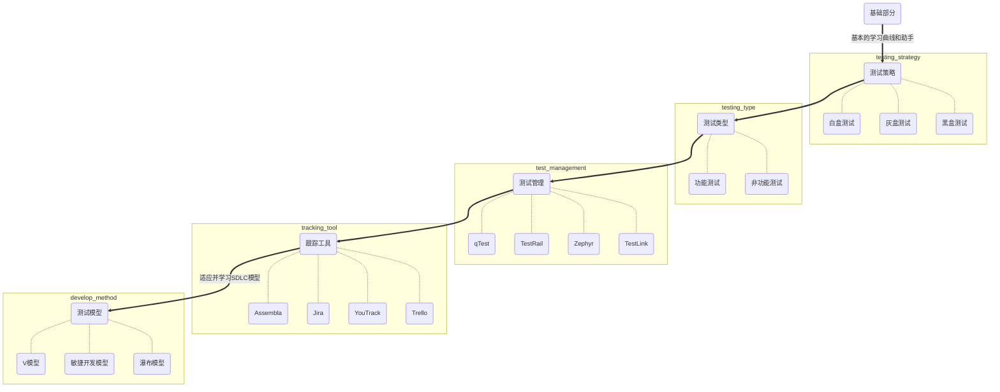
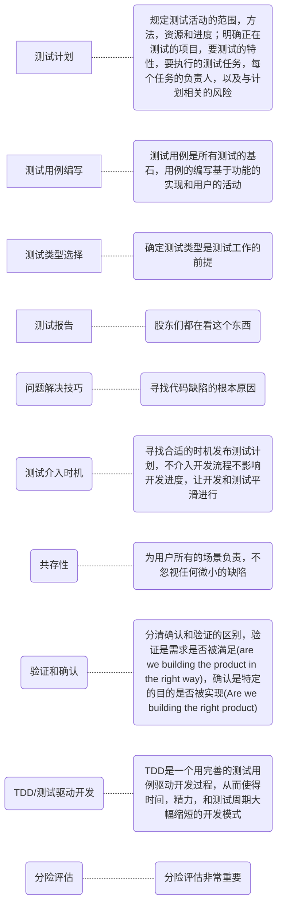
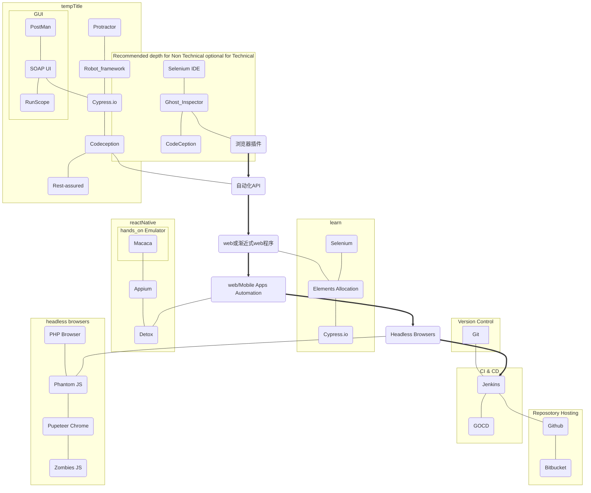
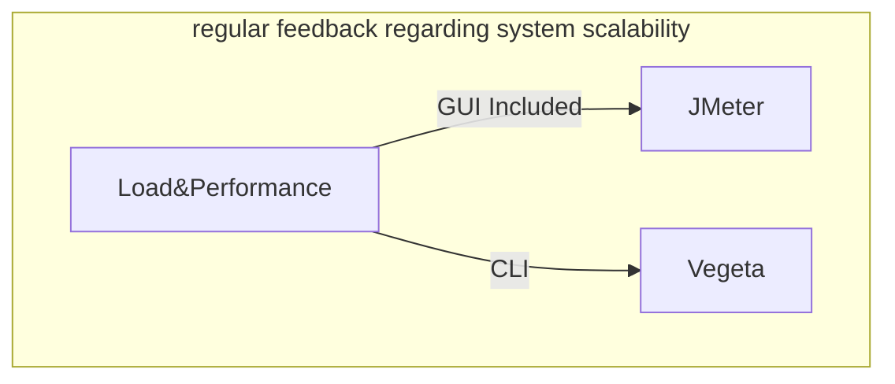

## 写在前面

> 翻译自[anas-qa](https://github.com/anas-qa)/**[Quality-Assurance-Road-Map](https://github.com/anas-qa/Quality-Assurance-Road-Map)**，本人刚刚入行软件工程行业不久，才疏学浅，如有翻译的不对之处，欢迎指正。

# 简介💻

如果你立志成为一名软件测试工程师（QA engineer），以下内容可以帮到你，下面的内容是关于软件测试主要方面和技术要求的简洁介绍。

# 测试计划模版📚

完整的测试计划模版可以在测试计划模版.pdf 处浏览或者下载

# 手动测试深度

1. 手动测试是任何软件测试的核心和基础，一个坚实丰富的基础会让你的职业生涯更加平稳
2. 做一个数据驱动的工程师可以节省你的时间，精力，让你有能力部署高质量而不是数量众多的测试案例

# 自动化测试深度

# 非功能性测试（负载&性能）

# 建议

鼓励软件质量工程师确认合理的掌握了以上内容，而不是直接跳去学习自动化测试。因为自动化测试只不过是将手写的测试用例可读性，可理解性和重用性更好的手动测试罢了

# 执照

MIT